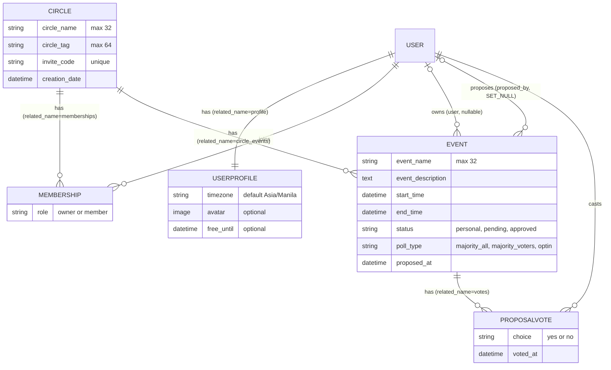
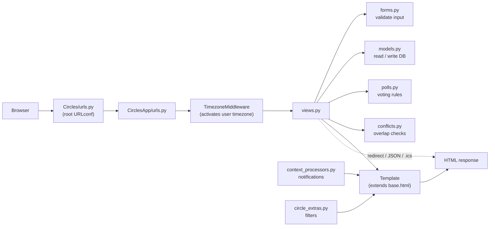
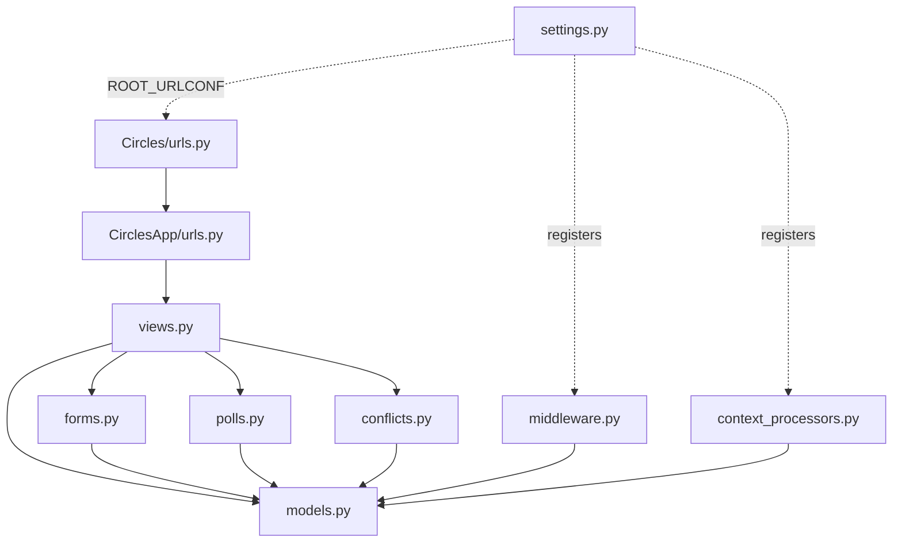
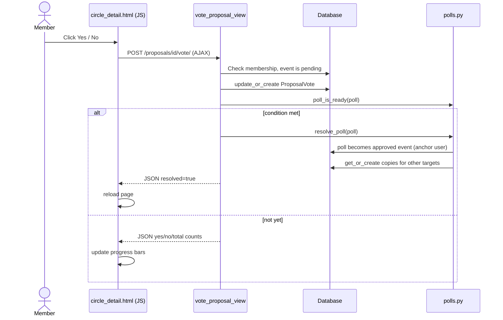
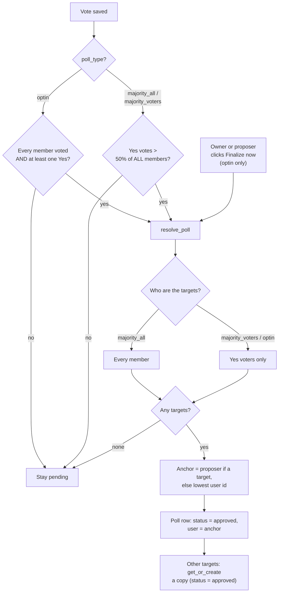
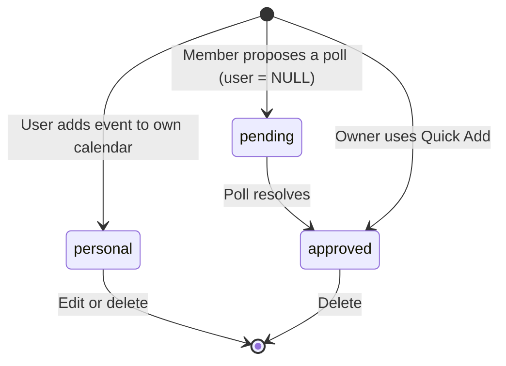

# Circles: Diagrams

These diagrams use [Mermaid](https://mermaid.js.org/), which GitHub renders automatically.
Save this file as `docs/diagrams.md` and link to it from the README.

## 1. Entity-relationship diagram

Unique constraints: `Membership(user, circle)` and `ProposalVote(event, user)`.
A pending poll has `Event.user = NULL`, so it never blocks anyone's calendar.

## 2. Request flow

In practice Django runs middleware before URL matching. The diagram orders them by what the
developer thinks about, not by exact execution order.

## 3. Module dependencies

`models.py` imports nothing from the app, which avoids circular imports.

## 4. Sequence: voting on a poll

## 5. Poll resolution logic

## 6. Event status lifecycle

Only `personal` and `approved` events count as busy time in conflict checks and the availability heatmap.
